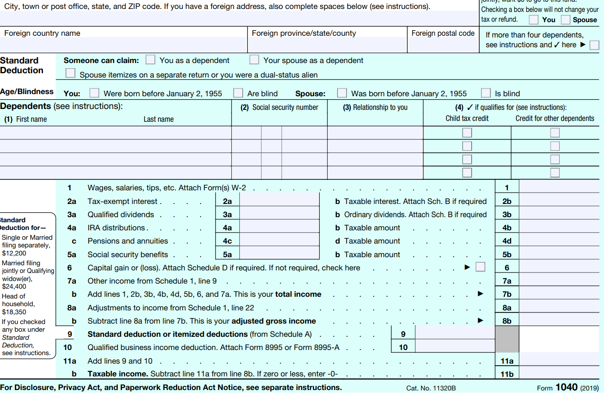
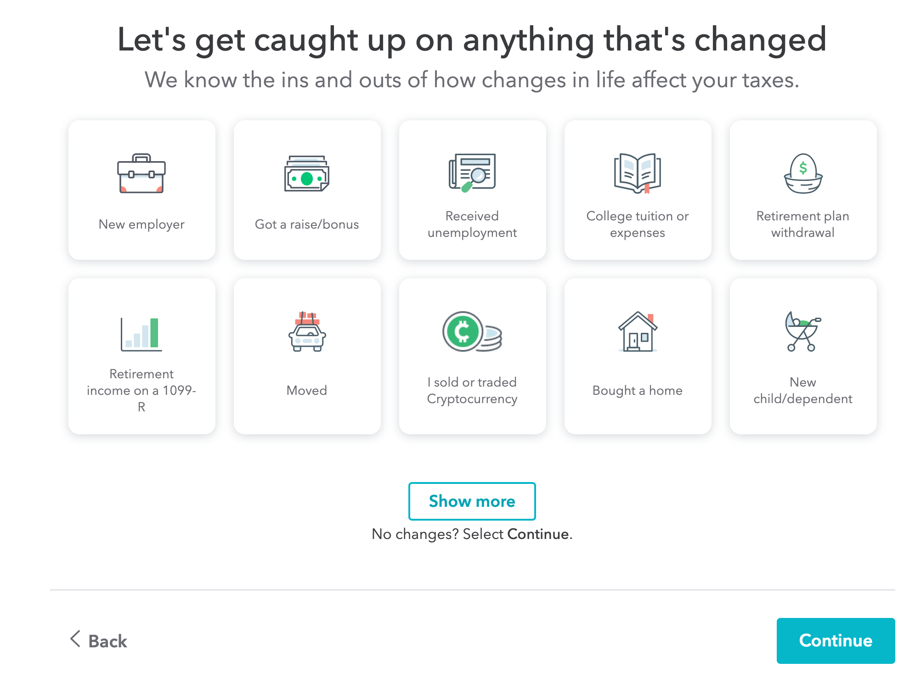
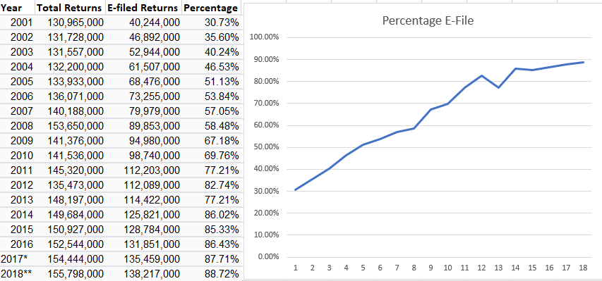

## Except Death and Taxes

As tax season rolls around another year I prepare to deal with another stack of papers that will serve one purpose for a few days and then spend a lifetime in my filing cabinet. Tax season is never something to look forward to, no matter how many times the IRS decides to add the abbreviation EZ to their 1040 form. 

Naturally this got me thinking about user interfaces and how the work I do before the user gets there ends up effecting how my product is treated. But first, look at the absolute state of this form.

All of these boxes vary greatly in their importance. How many of you reading this actually received tax-exempt interest or qualified dividends? Yet despite this discrepancy in value, visually all of them receive the same importance on the form.  The box for your yearly wages receives no more space than the box for social security payouts or capital gains. It's a mess.

## The interface as programming

The ease of how a potential user interacts with your program will probably determine how many people actually end up using it. As an example, how many of us mailed in or even manually filled out a filed a 1040 this year? Chances are good if you're reading an essay on UI design that you probably used a website that wraps all those messy forms into a neat package that looks something like this:

While UI and graphical UI aren't normally high ranking in 'coolness' to your average programmer, their implementation can determine whether or not anyone actually chooses to engage with your program. In the case of filing your taxes, we can see how this ease of formatting can influence mass user behaviour simply by looking at the IRS' own statistics on filing:

I understand that some other factors are influencing those percentages, such as the increasing prevalence of the internet and people manually E-filing, but just think of your own choice to use the more visually appealing option when given that choice. Now imagine you're trying to ask people to pay for a piece of software that you've designed, do you think something that looks like the 1040 will have people scrambling to open their wallets? (hint: Intuit, makers of TurboTax, had $6.7B in revenue last year)

## UI design from the maker's end

But a user never has to see how the sausage is made with their websites. They've never had to deal with CSS or html classes or !important for hours only to produce a website like <a href="http://dancing-baby.net/Babygif.htm">dancing baby</a> or <a href=https://templeos.org/>TempleOS</a>.
But then again, neither do we. 
